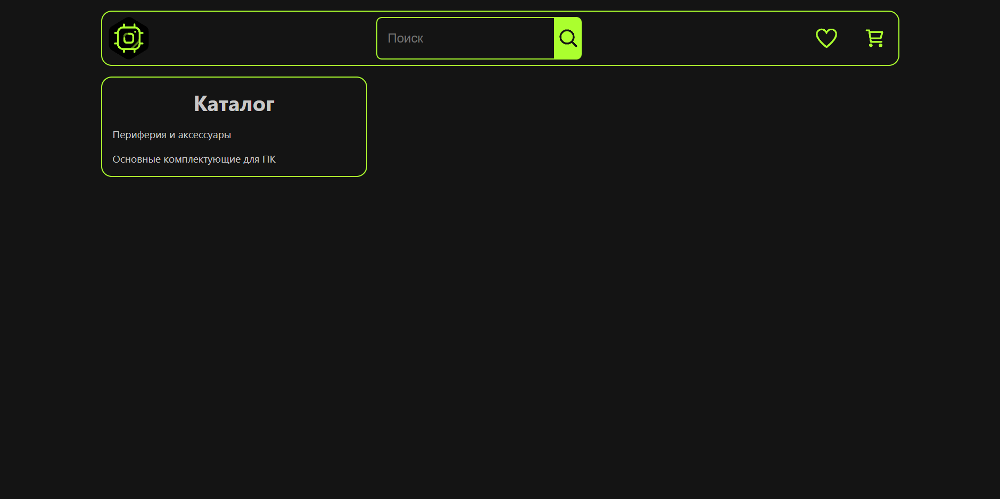

# TechStore + MobX

### **Start app**

1. _Either fork or download the app and open the folder in the cli_
2. _Install all dependencies using the `yarn` command_
3. _Build the project using the `yarn build` command_
4. _Start the web server using the `yarn preview` command. The app will be served at http://localhost:4173/._

### **Start JSON-server**

1. _Start server using the `yarn db` command_

---

 

<b>Screenshots</b>
    
  
<h3>Main</h3>

<h3>Catalog</h3>

<h3>Category</h3>

<h3>Search</h3>

<h3>Products</h3>

<h3>Product</h3>

<h3>Favorites</h3>

<h3>Basket</h3>

<h3>Adaptive</h3>

---

## **Technology stack:**

-  _Vite_
-  _React_
-  _Typescript_
-  _SCSS_
-  _MobX_
-  _Axios_
-  _@tanstack/react-query_
-  _React-router-dom_
-  _json-server_
